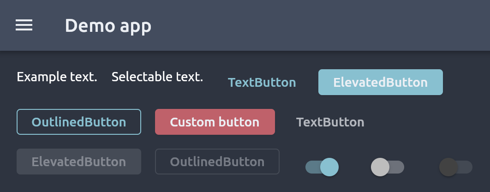

# flutter_nord_theme

An arctic, north-bluish theme for Flutter, based on the
[Nord theme](https://www.nordtheme.com/).
**Warning**: This is not an official theme (not made by Arctic Ice Studio).



## Installing

First, add this package to your Flutter project (see also Installation).
In your `pubspec.yaml`, add `flutter_nord_theme` as a dependency:
```yaml
dependencies:
  flutter_nord_theme: <lastest version>
```

## How to use

#### NordTheme

Once the package is installed, you can pass either `NordTheme.dark` or
`NordTheme.light` as a `ThemeData` to your app.

```dart
class MyApp extends StatelessWidget {
  @override
  Widget build(BuildContext context) {
    return MaterialApp(
      themeMode: ThemeMode.light, // or [ThemeMode.dark]
      theme: NordTheme.light(),
      darkTheme: NordTheme.dark(),
      home: Scaffold(
        appBar: AppBar(title: Text('Title')),
        body: Center(child: Text('Example text.')),
      ),
    );
  }
}
```

#### NordColors

Apart from `NordTheme`, this package comes with a second class: `NordColors`, that provides various ways to access the 16 colors of the Nord palette (numbered from 0 to 16 as in the [docs](https://www.nordtheme.com/docs/colors-and-palettes)):
```dart
NordColors.$0; // a dart [Color], the same ones Flutter uses
NordColors.$13.withAlpha(0.5); // comes by default with a full opacity
```

In the official Nord documentation, the colors are not named, they are only numbered. For this package we decided to provide in addition to an access by their number a way to access the colors by names. For the correspondence, see the table below. Here is an example:

```dart
NordColors.frost.darker;
NordColors.aurora.green;
```


| Number | Name                |
|--------|---------------------|
|   0    | polarNight.darkest  |
|   1    | polarNight.darker   |
|   2    | polarNight.lighter  |
|   3    | polarNight.lightest |
|   4    | snowStorm.darkest   |
|   5    | snowStorm.medium    |
|   6    | snowStorm.lightest  |
|   7    | frost.lightest      |
|   8    | frost.lighter       |
|   9    | frost.darker        |
|   10   | frost.darkest       |
|   11   | aurora.red          |
|   12   | aurora.orange       |
|   13   | aurora.yellow       |
|   14   | aurora.green        |
|   15   | aurora.purple       |


## License

This package is licensed under the [MIT License](https://mit-license.org/).
